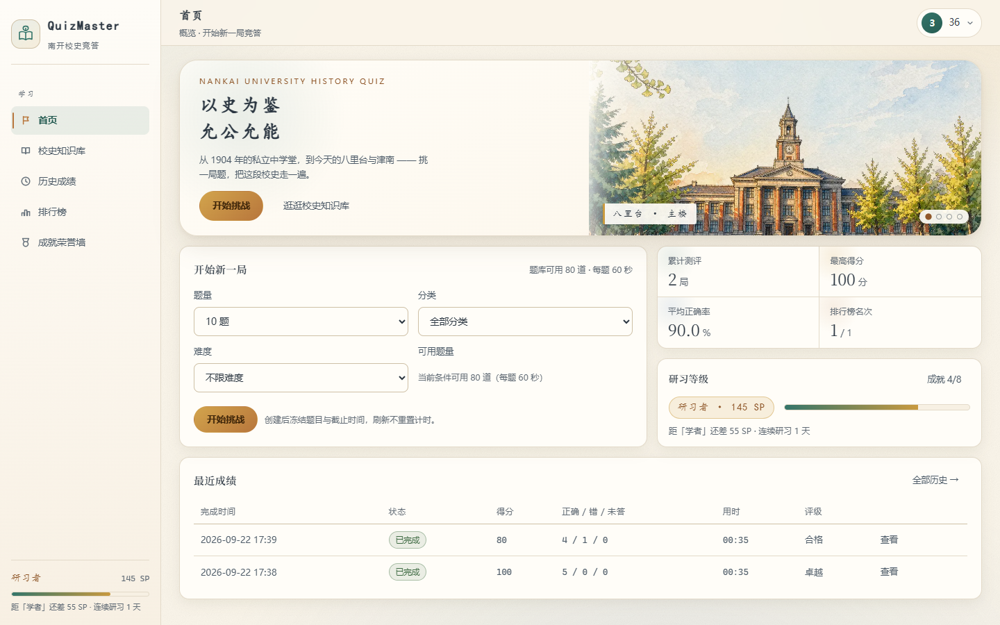
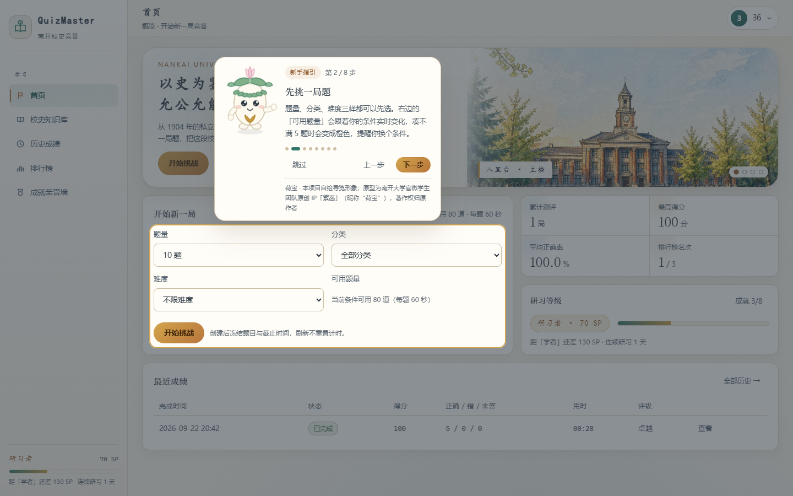
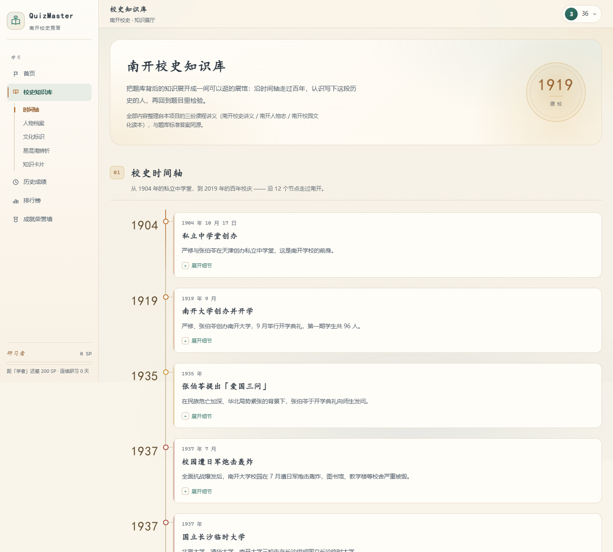
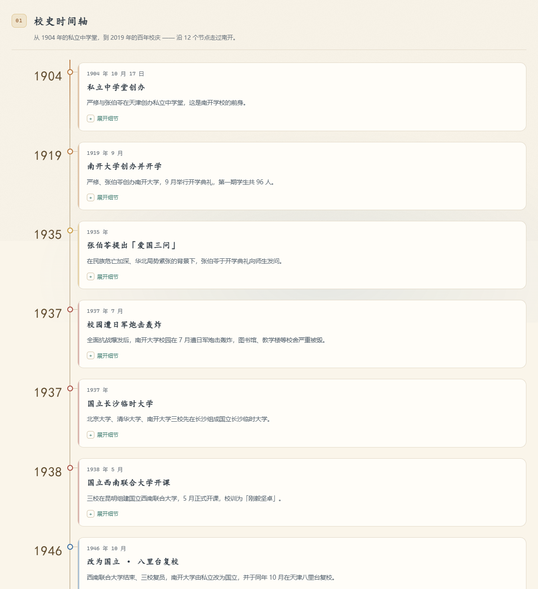
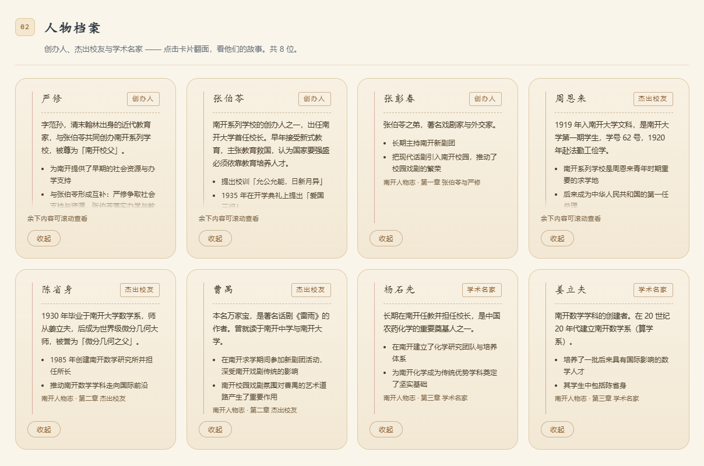
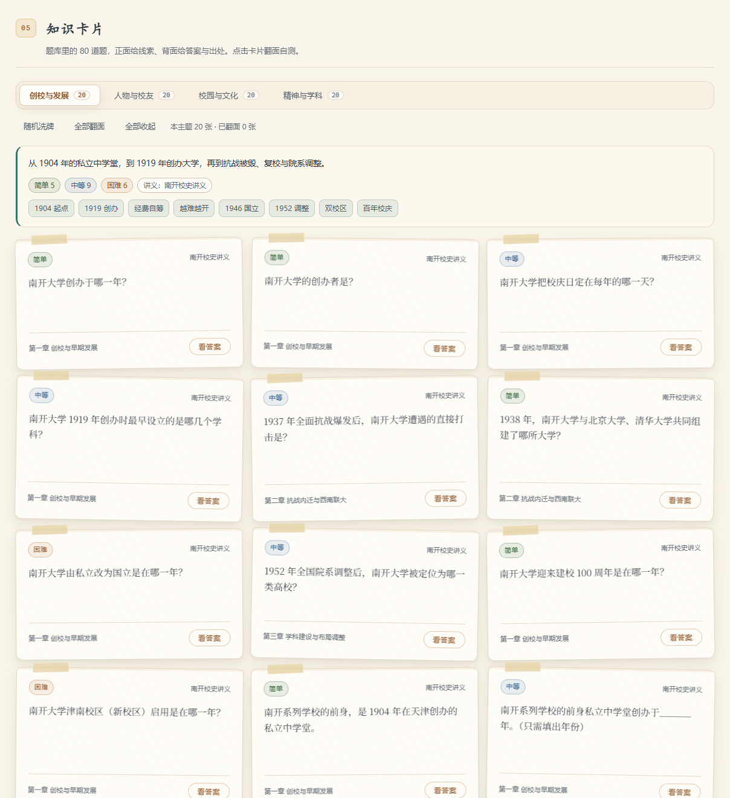
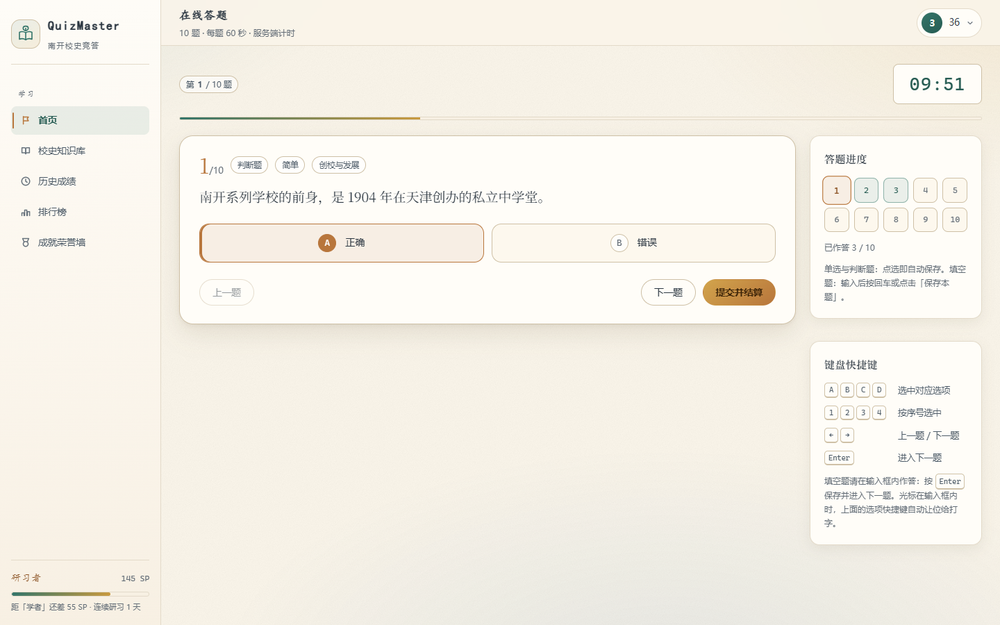
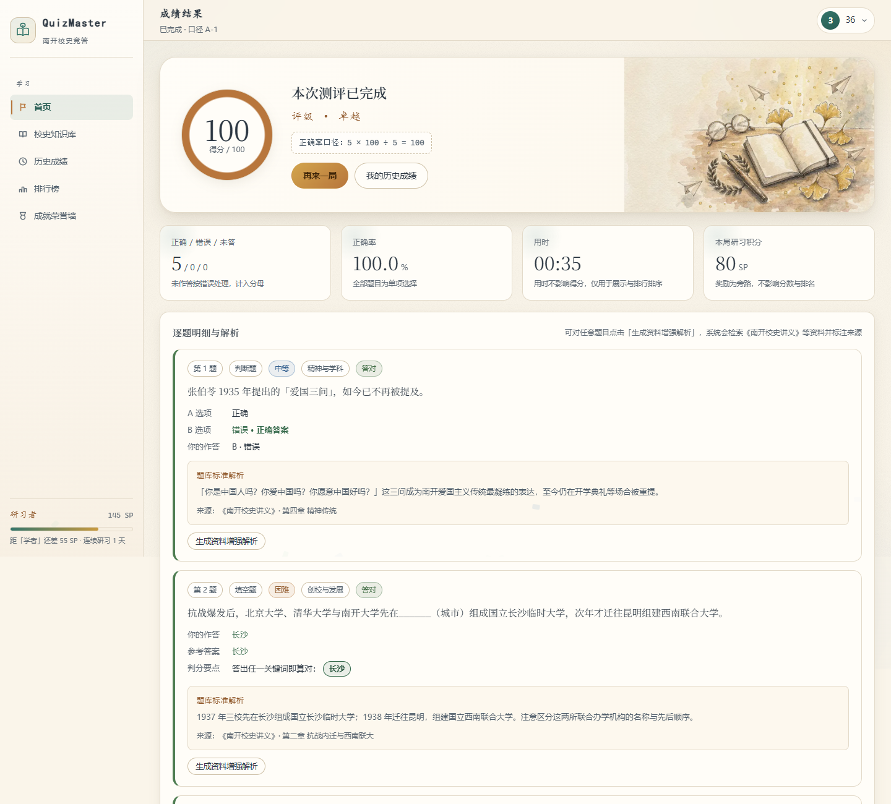
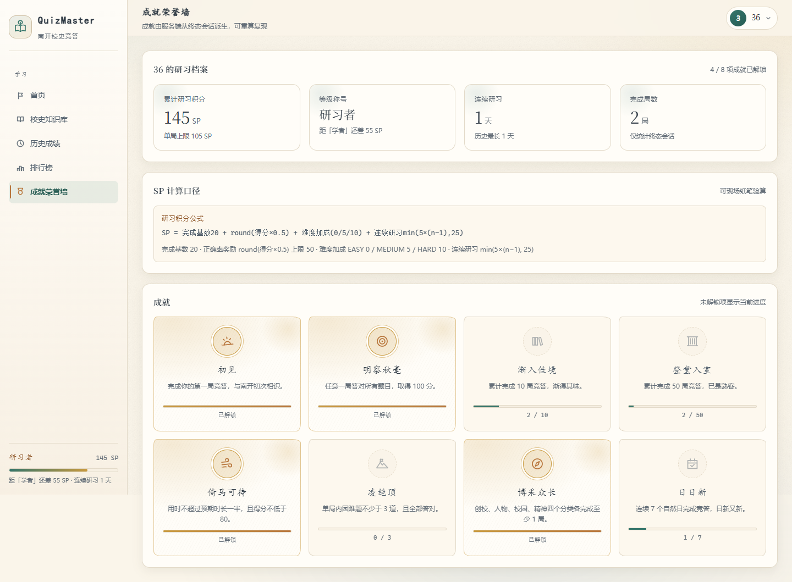
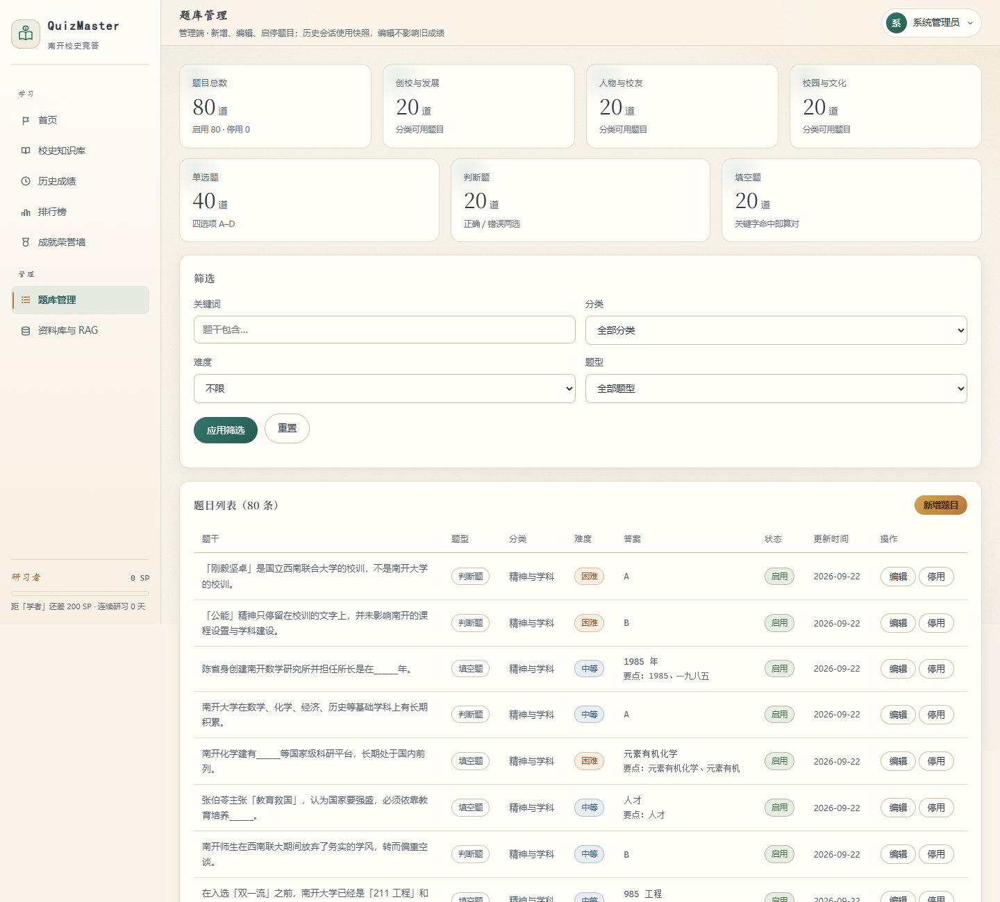

# 开发设计文档 · QuizMaster 南开校史在线知识竞答系统

> 对应选题：综合实践项目第 17 题「在线知识竞答游戏」
> 实现语言：Python（FastAPI + SQLAlchemy + Jinja2），SQLite 持久化
> 文档结构对应课程《开发设计文档要求》

---

## 1. 背景与目标

课程要求实现一个具备完整数据闭环的知识竞答系统。本项目以**南开大学校史**为题材，目标有三层：

1. **闭环可用**：题库维护 → 随机抽题 → 服务端计时 → 服务端判分 → 成绩持久化 → 历史与排行榜，全链路可跑通、重启后数据仍在。
2. **规则可验**：所有计分与状态迁移由服务端决定并留下可复核的痕迹（口径版本 + 逐题拆解），现场可用纸笔验算。
3. **增强克制**：在 P0 闭环稳定之上叠加两个增强项——得分奖励体系与轻量 RAG，且两者都能**一键关闭**、任何故障都不影响核心成绩。

## 2. 范围与非目标

### 2.1 范围（已实现）

| 模块 | 内容 |
|---|---|
| 账户 | 注册、登录、登出、角色（STUDENT / ADMIN）、HttpOnly 签名 Cookie |
| 题库 | 分类、难度、**三种题型（单选 / 判断 / 填空）**、题干与选项、标准答案、填空题判分关键字、标准解析、来源标注、启停（软删除） |
| 竞答 | 5/10/20 题、按分类与难度筛选、随机不重复抽题、题目快照、服务端倒计时、断线不重置 |
| 判分 | 按题型分派（键位比对 / 关键字判分）、正确率口径、未答按错、超时不扣分、评级、得分拆解、口径版本 |
| 统计 | Dashboard 四项指标与趋势、历史成绩分页筛选、排行榜按用户聚合 |
| 奖励 | 研习积分 SP、5 级称号、连续研习、8 项成就、重算接口 |
| RAG | 讲义导入与切分、BM25 稀疏检索、模型生成、引用校验、缓存、全链路降级 |
| 引导 | 可跳过的分步新手指引（荷宝导览）：步骤由服务端定义、按页面锚点过滤、账号级已读、无脚本不留死控件 |
| 质量 | 104 项自动化测试、87 项 HTTP 冒烟测试（不带 `--with-rag` 为 84 项）、统一错误码、统一响应结构 |

### 2.2 非目标（明确不做）

- 实时多人竞赛、房间匹配。
- 积分商城、积分消费、抽奖、充值。
- 题型扩展（多选、主观题 / 人工阅卷）。**单选、判断、填空题已于 v2.0 实现**，见 §9.2。
- 微服务拆分、消息队列、缓存中间件。
- 向量数据库 / 本地 embedding 模型（RAG 采用稀疏检索替代）。
- 移动端原生应用。

## 3. 角色与权限矩阵

| 能力 | 未登录 | STUDENT | ADMIN |
|---|---:|---:|---:|
| 访问登录页 | 是 | 跳转首页 | 跳转首页 |
| 访问业务页面（首页 / 历史 / 排行 / 成就） | 跳转登录 | 是 | 是 |
| 创建会话 / 作答 / 提交 | 否 | 是 | 是 |
| 读取他人会话 | 否 | 403 | 403 |
| 题库读取（管理视图） | 否 | 403 | 是 |
| 题库新增 / 编辑 / 启停 | 否 | 403 | 是 |
| 资料导入 / 删除 / RAG 状态 | 否 | 403 | 是 |
| 奖励重算 | 否 | 403 | 是 |
| 生成自己会话的增强解析 | 否 | 是 | 是 |

权限实现要点：

- 角色由数据库字段决定，注册接口固定写入 `STUDENT`，**前端传 role 无效**。
- 会话访问统一走 `quiz_service.get_owned_session()`，非本人返回 `FORBIDDEN`，且不区分「不存在」与「无权」，避免越权探测。

## 4. 信息架构与页面清单

### 4.1 导航层级

全局导航只有三层。判据是：**一个功能只允许有一个一级入口**。

| 层 | 位置 | 承载内容 | 约束 |
|---|---|---|---|
| L1 主导航 | 左侧栏（`base.html`） | 首页 / 校史知识库 / 历史成绩 / 排行榜 / 成就荣誉墙；管理员再加 题库管理 / 资料库 | 常驻可见，当前项高亮。**各页唯一的入口** |
| L1.5 章节子导航 | 左侧栏内、`校史知识库` 项下方（`base.html`，`.nav-sub`） | 时间轴 / 人物档案 / 文化标识 / 易混淆辨析 / 知识卡片 | **仅在 `/knowledge` 渲染**（模板判断 `active_nav == 'knowledge'`）；它属于 L1 第 2 项的展开，不构成新的页面入口 |
| L2 用户中心 | 顶栏右上角 | 当前账号名、研习等级摘要；展开后只有「退出登录」 | 只放账号级操作，**不放导航** |
| L3 页内锚点 | 页面内部 | 首页「开始挑战」→ 开考表单；知识库章节之间互跳（即 L1.5 的目标） | 仅长页面出现 |

> **第三轮删掉的那三项**：右上角原先又列了一遍「成就荣誉墙 / 历史成绩 / 排行榜」，
> 与左侧栏完全同源。同一屏出现两个指向同一页面的入口，演示时必然被问
> 「这两个是不是不一样」。现在用户中心只剩操作，导航只剩一处。

> **章节子导航为什么放侧栏而不是页内**：知识库正文很长（时间轴 12 节点 + 人物 8 张 + 三类板块），
> 页内目录会随滚动跑掉，而侧栏本来就是 `position: sticky` 的。摘要是 `href="#锚点"` 的原生链接，
> JS 只负责平滑滚动与高亮当前章节 —— 关掉 JS 它仍是一个可用的跳转目录。

### 4.2 路由 → 模板 → 区块

| 路由 | 模板 | 主要区块 | 渲染方式 |
|---|---|---|---|
| `/login` | `login.html` | 左栏手绘插画（纸标签图注）+ 校训；右栏「登录 / 注册」双 Tab 表单 | SSR + JS 提交 |
| `/dashboard` | `dashboard.html` | ① 四帧轮播横幅（左文右图）② 左：开考表单；右：2×2 数字板 + 研习等级 ③ 最近成绩（两行） | SSR |
| `/knowledge` | `knowledge.html` | 校史导语（纸标签图注）/ 校史时间轴（12 节点 + 左轴色带 + 原生 `<details>` 展开）/ 人物档案卡（8 张可翻转的米黄档案袋）/ 文化标识 / 易混淆辨析 / 题卡自测；左栏另有章节子导航 | SSR + JS 增强 |
| `/quiz/start/{sessionId}` | `quiz.html` | 进度格 + 答题卡 + 题干区 + 选项或填空 + 快捷键提示 + 无障碍播报区 | SSR 骨架 + JS 交互 |
| `/result/{sessionId}` | `result.html` | 分数环 + 评级 + 得分算式 + 统计条 + 逐题解析 + RAG 增强区 | SSR + JS 增强 |
| `/history` | `history.html` | 状态筛选 + 分页表格 | SSR |
| `/leaderboard` | `leaderboard.html` | 我的名次卡 + Top 榜 | SSR |
| `/achievements` | `achievements.html` | 成就墙（印章式图标，已解锁 / 未解锁）+ SP 口径说明 + 管理端重算入口 | SSR |
| `/admin/questions` | `admin_questions.html` | 筛选栏 + 题目列表 + 内联编辑器 | SSR + JS CRUD |
| `/admin/knowledge` | `admin_knowledge.html` | 资料库列表 + 索引状态 + 导入 + 降级策略对照表 | SSR + JS |

### 4.3 可复用 UI 单元

页面由下列单元拼装，样式集中在 `app/static/css/app.css`，不引入前端框架。

| UI 单元 | 类名 / 宏 | 用在哪 |
|---|---|---|
| 卡片 | `.card` + `.card-title` | 首页开考 / 等级 / 最近成绩；历史、排行、成就、管理端 |
| 按钮 | `.btn`、`.btn-gold`、`.btn-ghost`、`.btn-sm`、`.btn-block` | 全站 |
| 状态标签 | `.tag`、`.tag-ok`、`.tag-danger` | 成绩状态、题型标注 |
| 数字板 | `.stat-board` + `.board-item` | 首页四张统计卡（用 1px 间隙当分隔线，不画四条边框） |
| 数据表 | `table.data`（`.compact` 为紧凑版） | 最近成绩、历史成绩、题库列表 |
| 表单行 | `.form-row` + `.field` | 开考配置、登录注册、题库编辑器 |
| 时间轴 | `.timeline` + `.tl-node` / `.tl-axis` / `.tl-dot` / `.tl-card`（节点色由 `--era` 变量决定） | 知识库「校史时间轴」 |
| 人物档案卡 | `.person-card` + `.dossier-tab` / `.dossier-holes` / `.person-fields` / `.flip-back-scroll` | 知识库「人物档案」（内层套下面的翻转卡壳；背面超长时内部滚动） |
| 翻转卡壳 | `.flip` + `.flip-inner` + `.flip-face` / `.flip-back`（JS 切换 `.is-flipped`） | 人物档案、题卡自测 |
| 章节子导航 | `.nav-sub` + `.nav-sub-item`（`.is-current` 高亮当前章节） | 左侧栏，仅在 `/knowledge` 渲染 |
| 便签卡 | `.quiz-card`（`rotate` 微倾 + 和纸胶带 + 纸纹） | 知识库「题卡自测」 |
| 印章图标 | `.ach` + `.ach-icon`（已解锁加描边印章环） | 成就荣誉墙 |
| 轮播横幅 | `.hero-figure[data-hero-slides]` + `.hero-caption` + `.hero-dot` | 首页 |
| 空态 | `.empty` | 无成绩、无检索结果的兜底 |
| 轻提示 | `toast()`（`app.js`） | 所有异步失败的统一出口 |
| 无障碍播报 | `.sr-only` + `aria-live` | 答题页判分结果播报 |
| 内联图标 | `_icons.html` 中的 Jinja 宏 | 侧栏、按钮、空态（不使用 Unicode 符号） |
| 虚拟形象 | `_mascot.html` 的 `mascot(pose)` 宏（4 姿势，透明背景内联 SVG） | 新手指引卡、首页空态、登录页提示行 |
| 分步指引 | `.tour-layer` / `.tour-spot` / `.tour-card`（`_tour.html` + `tour.js`） | 全站（登录后），见 §17 |

### 4.4 权限与可见性

页面可见性由 §3 的角色矩阵决定：学生侧 6 个页面（首页、知识库、答题、结果、历史、排行、成就）与管理员侧 2 个页面
（题库管理、资料库）在**左侧栏按角色渲染**，未授权路由在服务端直接 403，而不是靠前端隐藏。
会话级数据统一走 `quiz_service.get_owned_session()`，非本人返回 `FORBIDDEN`。

### 4.5 JS 依赖边界（渐进增强）

| 页面 / 功能 | 关闭 JS 后的表现 |
|---|---|
| 首页、历史、排行榜、成就、管理端列表 | **正常**。数据全部服务端渲染；用户中心用 `<details>` 承担展开 |
| 知识库 | **正常**。时间轴 / 文化标识 / 辨析 / 卡片题干全为 SSR；章节子导航本就是 `href="#锚点"` 的原生链接（JS 只加平滑滚动与高亮）；人物档案与题卡的翻转由 `_head.html` 的 `<noscript>` 兜底 —— 正反面改为顺序堆叠，不翻转但内容完整 |
| 登录 / 注册 | **不可用**。表单靠 `fetch` 提交 JSON —— 这是刻意的：认证要走统一响应封装，不再维护第二套表单端点 |
| 答题页 | 题干与选项可读，但作答与计时依赖 JS |
| 结果页 | 分数、算式、逐题解析均可见；只有「资料增强解析」需 JS 按需拉取 |
| 入场动效 | 完全可降级。`html.anim` 由 JS 注入，JS 缺失或 `prefers-reduced-motion: reduce` 时 `.reveal` 不隐藏、动画全部关闭 |

> SSR 为主是为了让页面**在 JS 失效时依然看得到真实数据**，把现场演示的故障面压到最小；
> 真正依赖 JS 的只有「登录」与「作答」这两个必须发请求的动作。

## 5. 视觉设计

### 5.1 风格与色彩

- **关键词**：手绘、明亮、纸感、信息密度适中。
- **插画使用**：六张手绘水彩插画分别承担首页横幅轮播（`hero-campus` / `hero-xinkaihu` / `hero-muzhai` / `hero-jinnan`，四帧）、登录页左栏（`hero-library`）与结果页横幅（`hero-desk`）。首页与结果页采用「左文右图」：插画完整可见，文字落在亮纸面上 —— 不再用「照片铺满整块 + 深色遮罩压白字」。
- **色彩**：米白纸面（`#faf5ea`）打底、暖白卡片（`#fffdf8`）；文字用墨色（`#2c3742`）；主色为水彩青绿 `#34756a`，强调色为赭石 `#b8763c`，成就与印章用银杏金 `#c99a3f`。
- **对比度**：正文对纸面 11.0:1，次要文字 6.4:1，最弱的辅助文字仍有 4.9:1 —— 连 11.5px 的脚注都满足 WCAG AA。金色按钮配深墨字（4.9:1）而非白字（白字压在同款金底上只有 2.9:1，达不到标准）。
- **字体**：正文用系统无衬线；标题与分数用衬线体体现正式感；**大字号装饰改用楷体**（横幅标题、时间轴年份、人物姓名、等级称号），让手写笔意与手绘插画同源 —— 楷体只用于大字号，12px 下笔画细节会糊成一片。
- **质感**：整页叠一层极淡的纸纤维噪点（内联 SVG `feTurbulence` + `mix-blend-mode: multiply`），固定定位；滚动时纸纹不动，像是在纸上移动视线，而不是图片在动。

### 5.2 动效

以「状态反馈、阅读引导、关键时刻的收束」为目的，不飘屏、不弹跳、不连续闪烁。全部只动 `transform` 与 `opacity`，统一 ease-out 家族缓动，并在 `prefers-reduced-motion` 下整体退化为即时状态。详见第 15 章。

三个关键时刻有专门编排：

| 时刻 | 效果 |
|---|---|
| 答题结束（提交或超时） | 题卡「合上」下沉淡出（420ms）、进度条扫过一道金光，然后再跳转，总时长约 460ms |
| 获得成就 | 成就卡逐张浮起（错峰 110ms），图标像盖章一样从 2.1 倍缩放落下并回弹，随后一圈金色水波扩散；得分 ≥85 或解锁成就时另撒庆祝粒子 |
| 切题 | 题干横向推入（420ms）、四个选项依次上浮（错峰 50ms），给「换了一题」一个方向感 |

此外，底色水彩晕极慢游动（84s 周期、位移 ≤6%）、横幅插画呼吸（26s、缩放 1.5–4.5%）、知识库建校年份印章轻微摆动（12s），共同提供「不压抑」的流动感。

### 5.3 响应式

1280×720 为验收基准；≤1100px 侧栏收窄、横幅与答题双栏转单栏；≤820px 侧栏转为横向滚动条、统计卡单列。

### 5.4 第二轮整体重设计（记录）

第一版是「深色沉稳 + 实景大图 + 金色点缀」。上线后发现三处问题：整屏暗色偏压抑、实景照片把标题压成低对比度白字、照片本身还带版权与水印负担。第二轮按 **redesign** 处理 —— **产品事实、内容、功能与技术约束全部保留，只替换视觉世界**：

| 维度 | 第一版 | 第二版 |
|---|---|---|
| 底色 | 深蓝黑 `#0a0f1a` | 米白纸面 `#faf5ea` |
| 图片 | 2 张网络检索的实景照片 | 3 张自有手绘插画（第三轮扩到 6 张，见 5.5） |
| 横幅 | 照片铺满 + 深色遮罩 + 白字 | 左文右图，文字落在亮纸面 |
| 标题字体 | 衬线体 | 楷体（仅大字号） |
| 主色 | 品牌蓝 `#4a7fb5` | 水彩青绿 `#34756a` |
| 个人信息 | 侧栏底部 | 顶栏右上角（原生 `<details>` 下拉） |
| 侧栏底部 | 头像 + 称号 + SP（**缺经验条**） | 等级 + 经验条 + 距下一级差额 |
| 成就图标 | `★` / `☆` 两个 Unicode 符号 | 8 个独立设计的内联 SVG |
| 品牌徽记 | 「NK」两个字母套圆环 | 翻开的书 + 一片银杏 |
| 成就命名 | 首战 / 满分达成 / 十局学者… | 初见 / 明察秋毫 / 渐入佳境… |

### 5.5 第三轮：去「AI 味」与单屏首屏（记录）

第二轮解决了「暗、版权、对比度」三个问题，但用起来又冒出四个新毛病 —— 这一轮逐个处理，
**产品事实与接口一律不动，只改呈现与素材**：

| 问题 | 处理 |
|---|---|
| 卡片是清一色的圆角矩形 + 投影，一排排过去像后台管理模板 | 知识库卡片改成**贴纸便签**：撕纸边（`border-radius` 四个角各给一个不对齐的值）、每张按 `:nth-child(4n)` 给 −0.8°~+0.95° 的贴纸倾角、左上角一条和纸胶带、悬停时回正。倾角用 CSS 独立的 `rotate` 属性，**不占 `transform`** —— 入场动画还要用 `transform`，两者共用一个属性会互相覆盖。 |
| 成就墙是一列方块图标，解锁与未解锁只差颜色 | 解锁的成就做**印章**：图标倾斜 −6°、外面套一圈金色描边（`box-shadow` 三层模拟印泥晕染）；未解锁的改成虚线框。 |
| 首页从上到下铺了 hero + 4 张统计卡 + 等级卡 + 表单 + 最近成绩，900px 高的窗口要滚两次 | 中段改成左右两栏：左边开考表单，右边统计 2×2 + 等级卡；最近成绩只铺 2 行。再配合 `@media (min-width:1081px) and (max-height:870px)` 收紧留白，**整页压进一屏**。 |
| 首屏只有一张主楼插画，校史不止一栋楼 | 横幅改**轮播**：八里台新开湖、津南木斋图书馆、津南湖畔各一帧。脚本失效时 CSS 只让第一帧可见，所以无 JS 仍是一张完整插画。 |
| 六张插画若都存成 1200 宽 JPG 要 1255KB，首屏要一次挂四帧 | 统一改 **WebP**（q76，method 6）；首页四帧按槽位构图成 1152×512、登录/结果两张 960×594，合计 642KB（详见 5.6）。 |
| 图注是压在图上的白字（登录页还叠了一层深色渐变），四帧里总有一帧读不清，窄屏下更会落到近白底上 | 图注与轮播圆点统一改成**纸标签**：墨字 + 近白纸底 + 左侧一道金边。白字压在插画上一律取消，**登录页那层深色渐变压底也一并删掉** —— 它正是 §5.4 明确否掉的写法，自家文档和自家样式打架。 |

顺带把演示数据从交付物里摘干净：不再预置 `demo01-03` 学生账号与编造的答题历史，排行榜去掉「演示」标签，
登录页去掉写死口令的测试账号提示。**每个账号看到的都是自己的真实数据**，空状态就是空状态。

### 5.6 第四轮：首页横幅重新构图（记录）

第三轮留了个死角：**六张插画统一做成了 1.616:1，而首页插画框是 2.25:1。**

| 视口 | 插画框实测 | `object-fit: cover` 的后果 |
|---|---|---|
| 1440×900 | 565×252 = 2.246:1 | 只显示到图片高度的 **72%**，上下各裁掉 14% |
| 1280×800 | 487×228 = 2.132:1 | 显示 75.8% |
| 1000×1100（单栏） | 714×220 = 3.245:1 | 只显示 **49.8%**，等于横裁一半 |

新开湖那一帧的湖面正好落在被裁掉的下缘里 —— 横幅上是一片天空、树冠与楼，**整条湖不见了**。
第三轮把「首帧主楼的截图」当成了构图验收，而问题只出现在第二帧，所以没暴露。

**处理方式是改画幅，不是挪 `object-position`。** 挪焦点只能遮丑：框 2.25:1、图 1.62:1，信息量差着 28%，
挪来挪去总有一头被切。把交付图重构成槽位的形状，才是根治。

| 槽位 | 交付画幅 | 张数 | 尺寸 |
|---|---|---|---|
| 首页横幅轮播 | 2.25:1（对齐实测 2.246:1） | 4 | 1152×512 |
| 登录页 / 结果页 | 1.616:1（槽位 1.87:1；都是满幅纹理，裁 14% 不伤构图） | 2 | 960×594 |

裁切带按内容人工选定，不居中一刀切：主楼保住钟楼塔尖与草坪、木斋保住穹顶、大通保住垂柳与倒影，
新开湖把下沿顶到水印线 y=950，**换来整条湖、倒影与石岸都在画面里**。四帧合计 446KB，
加登录 / 结果两张共 **642KB**，仍在 680KB 预算内。`scripts/smoke_test.py` 第 10 组改为按槽位断言尺寸，
并加了一条「四帧画幅完全一致」—— 画幅不齐时切帧会出现「一张满、一张缩」的跳变。

配套两处样式：

- `@media (max-width: 1100px)` 下单栏时插画独占整行。原来 `min-height: 220px` 会把 714px 宽的框压成 3.2:1，
  再横裁一刀；改为 `aspect-ratio: 2.25 / 1`，锁定与交付图同比例。
- 插画左缘那道「渐变到纸色」的衔接带，原止点在 42%，等于把插画左侧四成糊成纸色 —— 湖面左段
  （石岸、小亭）被洗得几乎看不见。止点收到 22%，只留一道窄过渡。

### 5.7 第五轮：知识库板块重构（记录）

知识库是唯一「用来读」的页面，但它的首屏长成了一个仪表盘。这一轮把它改回阅读型页面。

**一、数字看板整块删除。** 原先首屏是 8 格统计卡（题库 80 / 分类 4 / 资料块 N ……），
下方才是正文。问题是这 8 格与页面主题不同源：它们统计的是**题库与检索库**，而页面讲的是**校史**。
读者点进「校史知识库」期待第一眼看到时间轴，却先看到一堆和校史无关的计数 —— 于是既挡了正文，
又让人以为页面主体是数据面板。**删掉后首屏直接是校史导语 + 时间轴**，页面从「仪表盘 + 阅读」收敛为「阅读」。
被删掉的计数并没有失效：题库规模在首页数字板上、资料库索引状态在 `/admin/knowledge` 都有归属，
它们本就该待在那里。

**二、章节子导航进侧栏，而不是页内。** 正文五段（时间轴 / 人物档案 / 文化标识 / 易混淆辨析 / 知识卡片）
加起来远超一屏，而页内目录会随滚动跑掉。侧栏本就是 `sticky`，把目录挂在校史知识库那一项下方最自然
（见 §4.1 的 L1.5）。它**只在 `/knowledge` 渲染** —— 别的页面没有这些锚点，渲染出来是一串死链。
实现上是 `href="#锚点"` 的原生链接，JS 只叠加平滑滚动与当前项高亮，关掉 JS 仍是可用目录。

**三、时间轴去掉冗余标签、把轴线画出来。**

| 改动 | 原因 |
|---|---|
| 删掉节点左上角的两字分类标签（`创校`/`抗战`…） | 它与年份、标题三行叠在同一张卡上，信息重复；分类的含义改由**颜色**承载 |
| 轴线 `1px` → `2px`，颜色 `--line` → `--line-2` | 旧轴线用 `--line`（#e3dac9）画在纸色（#faf5ea）上，对比度约 **1.15:1** —— 屏幕上根本看不见，时间轴读起来是一列悬空的卡 |
| 节点色收敛到 `--era` 变量（`.tl-node-创校{--era:…}`） | 轴点、卡片左色条、悬停态共用同一变量，换分类只改一行 |
| 卡片加左缘色条 + 年份改楷体深色（`#5f4a2c`） | 让「哪一年、属于哪个时期」在扫读时成立 |

**四、人物卡改成米黄档案袋。** 原来是一张通用翻转卡：正面头像 + 姓名，背面一段简介。
改为档案袋意象 —— 顶部「人物档案」标签页、左侧两孔装订孔、底部字段区（`dt` 时期 / 标签 + `dd` 值）。
内层仍是同一个 `.flip` 翻转壳，**只换外观不新增交互**。
米黄底（`#f4e8d1` → `#eedfc2`）与全站纸色拉开一点层次，同时和手绘水彩的暖调同族。
第一版在右上角压了一枚朱泥姓氏小章（严 / 张 / 周…），**后来删掉了**：姓氏与姓名本身就是重复信息，
8 位里还有两位同姓（张伯苓 / 张彭春），印上去既区分不了人，又和姓名的视线打架。

**五、两条兜底不因为是「纯静态页」就省掉。** 这一轮加了两个组件级兜底：

- `<noscript>`：把翻转卡的正反面改为顺序堆叠（不旋转、背面 `backface-visibility` 放开），
  并隐藏翻面按钮、取消 `min-height` —— 没有脚本时内容完整可读，只是不能翻。
- `_head.html` 的入场看门狗：`html.anim` 注入后 2.5s 若脚本仍未挂上 `anim-ready`，
  就把 `anim` 摘掉。避免 `app.js` 加载失败时 `.reveal` 永远停在透明态 —— 整个页面空白。

**六、卡片高度统一：写死高度，长档案改为背面内部滚动。**
原第一版用 `min-height: 306px`，于是**每行的高度由这一行里最高的一张决定，而每张卡的高度又由自己背面的
内容量决定** —— 第一行有张伯苓（生平 58 字 + 4 条要点）撑到 **420px**，第二行只有 **310px**，
两行差 110px；第一行正面中段因此空出一大块（`.person-fields{margin:auto 0 0}` 把字段压到底，
空白全堆在姓名与字段之间）。现在高度写死 `--person-h: 310px`（取第二行那个值），四列两行顶底齐平。

代价是长档案装不下：8 张里 3 张（严修 / 张伯苓 / 周恩来）的背面超出卡片，需要滚动。
所以背面加了滚动盒 + 未滚到底时的底部渐隐 + 「余下内容可滚动查看」提示，
**提示只在真溢出时出现**（`app.js` 的 `initFlipOverflow()` 挂 `.is-overflowing`）——
没溢出的卡不该谎报可滚动。要换成「完全不滚动」，把 `--person-h` 调到 `420px` 即可（那正是第一行原来的自然高度）。

> 这里有个只改一处会踩的坑：光写 `.person-card{height:310px}` 是不够的。两面（正 / 反）是同一个 grid 单元
> 里的叠放项，而 grid 项的 `min-height` 默认是 `auto` —— 内容比卡片长时，它会按内容撑到 420px
> **溢出圆角边框**（文字压到卡片外面），而不是去激活内层滚动。所以还得给 `.flip-inner` 写死
> `grid-template-rows`、并给两面加 `min-height: 0`。

> 验收数据：时间轴 12 节点 / 人物档案 8 张（**高度均一，实测 310px × 8**，其中 3 张背面可滚动）/
> 章节目录 5 项，且 `/dashboard` 上不出现章节目录。
> 详见 §13.3 的冒烟断言。

## 6. 数据模型

### 6.1 表总览

| 表 | 作用 | 关键约束 |
|---|---|---|
| `users` | 用户与角色、SP、连续研习 | `username` 唯一，`study_points` 索引 |
| `categories` | 题目分类 | `name` 唯一 |
| `questions` | 当前题库 | `qtype` 索引；复合索引 `(is_active, category_id, difficulty)` |
| `quiz_sessions` | 一次完整竞答与最终成绩 | `(user_id, created_at)`、`(status, score)` 索引 |
| `session_questions` | 本局题目与标准答案**快照** | 唯一 `(session_id, order_no)`、`(session_id, original_question_id)` |
| `quiz_answers` | 用户对某题的最终选择 | `session_question_id` 唯一 → 一题一记录 |
| `knowledge_documents` | 讲义元数据与内容哈希 | `content_hash` 用于幂等导入 |
| `knowledge_chunks` | 讲义切片与关键词 | 外键级联删除 |
| `rag_explanations` | 增强解析缓存与引用 | 唯一 `(session_question_id, user_answer)` |
| `achievements` | 成就定义 | 主键 `code` |
| `user_achievements` | 成就解锁记录 | 唯一 `(user_id, achievement_code)` |
| `score_rules` | 判分口径版本 | 主键 `version`，默认 `A-1` |

### 6.2 关键设计决策

1. **题目快照**：`session_questions` 保存题干、选项、标准答案、解析、分类与难度的完整副本。管理员日后编辑或停用题库，**历史成绩与解析不受任何影响**（有自动化测试覆盖）。
2. **一题一答案**：`quiz_answers.session_question_id` 唯一，重复选择是 update 而非 insert，保证重复操作可控。
3. **口径版本化**：`quiz_sessions.rule_version` + `score_rules` 表，规则调整通过新增版本表达，历史会话按自身版本回溯解释，不会被重算。
4. **时间统一 UTC**：数据库存 naive UTC，展示层转东八区，避免 SQLite 丢失时区造成歧义。
5. **SP 不由用户表外的第二数据源提供**：等级与称号由 `study_points` 通过纯函数计算，不落库。
6. **题型字段增量演进，不引入迁移框架**：`questions` 新增 `qtype`（默认 `SINGLE`）、`keywords_json`，`session_questions` 新增 `qtype_snapshot`、`keywords_json_snapshot`，`quiz_answers.user_answer` 由键位宽度放宽到 120 字符以容纳填空文本。老库通过 `app/core/db.py` 的 `ensure_columns()` 在启动时按「缺哪列补哪列」的方式 `ALTER TABLE ... ADD COLUMN` —— SQLite 没有 `ALTER COLUMN`，也无法表达枚举，所以这里选择**只用新增、不改类型**的兼容策略：历史会话与成绩全部保留（本项目实测保留了 66 局历史会话，重启后仍可查）。
7. **快照必须带上题型**：`session_questions` 快照同时冻结 `qtype_snapshot` 与 `keywords_json_snapshot`。若只冻结题干与答案，事后管理员改了题型，历史会话就会用新口径去解释旧作答 —— 这与「历史成绩不可漂移」是同一条铁律。

## 7. API 设计

### 7.1 统一响应

```json
{ "success": true,  "data": { }, "requestId": "a1b2c3d4e5f60718" }
{ "success": false, "error": { "code": "QUESTION_NOT_ENOUGH", "message": "当前条件下仅有 4 道可用题目" }, "requestId": "..." }
```

`requestId` 由中间件生成并回写响应头 `X-Request-Id`，便于对照日志定位。

### 7.2 接口清单

| 方法 | 路径 | 权限 | 说明 |
|---|---|---|---|
| POST | `/api/auth/register` | 公开 | 注册（角色固定 STUDENT） |
| POST | `/api/auth/login` | 公开 | 登录并写入 HttpOnly Cookie |
| POST | `/api/auth/logout` | 公开 | 清除会话 |
| GET | `/api/auth/me` | 登录 | 当前用户 |
| GET | `/api/categories` | 登录 | 启用分类及各分类可用题量 |
| GET | `/api/quiz/availability` | 登录 | 筛选条件下的可用题量 |
| POST | `/api/quiz/sessions` | 登录 | 创建会话并随机抽题 |
| GET | `/api/quiz/sessions/{id}` | 会话所有者 | 恢复本局（**不含标准答案**），惰性超时结算 |
| PUT | `/api/quiz/sessions/{id}/answers/{sqId}` | 会话所有者 | 保存 / 修改选择 |
| POST | `/api/quiz/sessions/{id}/submit` | 会话所有者 | 主动提交或超时结算（幂等） |
| GET | `/api/quiz/sessions/{id}/result` | 会话所有者 | 终态结果与解析 |
| GET | `/api/dashboard` | 登录 | 四项指标、趋势、最近记录 |
| GET | `/api/history` | 登录 | 历史成绩（分页 / 状态筛选） |
| GET | `/api/leaderboard` | 登录 | 聚合排行榜与我的名次 |
| GET | `/api/rewards/summary` | 登录 | SP、等级、连续研习、成就数 |
| GET | `/api/rewards/achievements` | 登录 | 成就墙与进度 |
| POST | `/api/admin/rewards/recompute` | ADMIN | 重算 SP / 连续天数 / 成就 |
| POST | `/api/admin/knowledge` | ADMIN | 导入讲义并建索引 |
| GET | `/api/admin/knowledge` | ADMIN | 资料列表与 RAG 状态 |
| DELETE | `/api/admin/knowledge/{id}` | ADMIN | 删除资料及切片 |
| POST | `/api/rag/explanations` | 会话所有者 | 生成资料增强解析 |
| GET | `/api/admin/questions` | ADMIN | 题库分页 / 搜索 / 筛选（含题型） |
| POST | `/api/admin/questions` | ADMIN | 新增题目 |
| GET/PUT | `/api/admin/questions/{id}` | ADMIN | 查看 / 编辑题目 |
| PATCH | `/api/admin/questions/{id}/active` | ADMIN | 启用 / 停用 |
| DELETE | `/api/admin/questions/{id}` | ADMIN | 软删除（等同停用） |
| GET | `/api/admin/questions/stats` | ADMIN | 题库统计 |
| GET | `/api/admin/overview` | ADMIN | 平台概览 + 题库统计 |
| GET | `/healthz` | 公开 | 健康检查（含开关与模型配置状态） |

### 7.3 错误码

| 错误码 | HTTP | 场景 |
|---|---:|---|
| `AUTH_REQUIRED` | 401 | 未登录 |
| `INVALID_CREDENTIALS` | 401 | 用户名或密码错误（不区分二者） |
| `FORBIDDEN` | 403 | 越权访问 |
| `USERNAME_TAKEN` | 409 | 用户名占用 |
| `VALIDATION_ERROR` | 400 | 参数校验失败 |
| `QUESTION_NOT_ENOUGH` | 400 | 可用题目不足 |
| `SESSION_NOT_FOUND` | 404 | 会话不存在 |
| `SESSION_FINISHED` | 409 | 终态会话不可再作答 |
| `SESSION_EXPIRED` | 409 | 已超时 |
| `INVALID_OPTION` | 400 | 单选/判断题选项非合法键位；填空题答案为空或超过 60 字 |
| `NOT_IN_SESSION` | 400 | 题目不属于本局 |
| `RAG_DISABLED` / `RAG_NO_DOCUMENT` / `RAG_NO_RELEVANT_CHUNK` / `RAG_MODEL_ERROR` / `RAG_INVALID_OUTPUT` | 409 / 409 / 404 / 502 / 502 | RAG 各类降级 |
| `REWARD_UNAVAILABLE` | 409 | 奖励结算失败 |
| `INTERNAL_ERROR` | 500 | 未捕获异常 |

## 8. 状态机与核心业务规则

```
[*] --创建会话(冻结题目与截止时间)--> IN_PROGRESS
IN_PROGRESS --主动提交(未过期)--> COMPLETED
IN_PROGRESS --任意访问(已过期)--> TIMEOUT   （惰性结算）
COMPLETED   --再次提交--> 返回原结果
TIMEOUT     --再次提交--> 返回原结果
```

状态迁移表：

| 当前 | 操作 | 条件 | 新状态 | 处理 |
|---|---|---|---|---|
| 无 | 创建会话 | 题量充足 | IN_PROGRESS | 冻结题目快照与 `expires_at` |
| IN_PROGRESS | 保存答案 | 未超时且选项合法 | IN_PROGRESS | upsert 最终选择 |
| IN_PROGRESS | 主动提交 | 未超过截止（含 3 秒宽限） | COMPLETED | 判分并锁定 |
| IN_PROGRESS | 任意请求 | 已超过截止 | TIMEOUT | 自动判分并锁定 |
| 终态 | 再次提交 | 任意 | 不变 | 返回原结果，不重复计分 |

不可变规则（实现与测试一一对应）：

1. 分数只能由服务端计算。
2. 一局的题目与标准答案在创建时形成快照。
3. 一局只允许一个最终状态，终态幂等。
4. 用户只能操作自己的会话。
5. 一个 `session_question` 最多一条 `quiz_answer`。
6. 标准答案在会话终结前不返回客户端。
7. 题目不足时创建失败，不生成缩水的一局。
8. 排行榜来自终态会话聚合，客户端不可上报。
9. 奖励只能由服务端从终态会话派生，且可重算复现。
10. 奖励不改变分数与排行；奖励失败不阻断成绩落库。

## 9. 判分口径与得分拆解

默认口径 A：`score = round(correct_count × 100 / question_count)`。

每局落库的 `score_breakdown_json` 形如：

```json
{
  "ruleVersion": "A-1",
  "scoringMode": "ACCURACY",
  "questionCount": 10,
  "correctCount": 8,
  "wrongCount": 2,
  "unansweredCount": 1,
  "weightSum": 10,
  "earnedSum": 8,
  "perQuestion": [
    { "orderNo": 1, "category": "创校与发展", "difficulty": "MEDIUM", "answered": "B",
      "correct": "B", "isCorrect": true, "weight": 1, "earned": 1 }
  ]
}
```

评级由服务端计算、仅用于展示。**用时不计入分数**，口径 B（难度加权）登记在 `score_rules` 但默认关闭。

### 9.1 三种题型与判分分派

| 题型 | 编码 | 作答形态 | 判分方式 |
|---|---|---|---|
| 单选题 | `SINGLE` | A–D 四选一 | 键位比对（`answer_is_correct`） |
| 判断题 | `JUDGE` | 正确 / 错误，复用 A=正确、B=错误 两个键位 | 键位比对，与单选完全同构 |
| 填空题 | `BLANK` | 自由文本（≤ 60 字） | 关键字判分（`judge_blank`） |

**判断题复用键位而不是新增答案形态**，是为了让快照、作答 upsert、结果页渲染这套既有机制原封不动地工作；差异只在「合法键位集合」—— 判断题只允许 A/B（`option_map()` 只返回非空选项，因此 C/D 会被 `save_answer` 直接拒绝），单选项才允许 A–D。

**填空题判分口径（刻意宽松，但设边界）** —— 这是产品需求明确要求的口径：

```
命中任一关键字  且  不含污言秽语  且  不属于「明显离谱」的输入  →  判对
```

- **关键字命中**：`KEYWORD_HIT_MIN = 1`，即答出任一关键字即可。例如校训题关键字为「允公允能」「日新月异」，写出任意一个即算答出要点。
- **归一化只用于比较，不回写原文**：`normalize_text` 做 NFKC 全角转半角、中文数字转阿拉伯数字（「一九一九年」能匹配关键字「1919」）、去空白与标点、小写化。结果页展示的始终是用户真正敲进去的那串字。
- **「特别离谱」的三类可判定情形**：超过 60 字（疑似整段粘贴）、单字连续重复 ≥ 5（灌水）、不含任何中文或字母数字（无意义输入）。
- **污言秽语**：命中短黑名单即判错，与是否答出关键字无关。黑名单刻意做得短而明确 —— 长名单既容易误伤，也需要持续维护。
- **参考答案兜底**：关键字全部未命中时，若用户答案归一化后与参考答案完全一致，仍判对。这避免了出题人漏配关键字导致整题判不动。

判分函数全部是**纯函数**（`judge_blank` / `answer_is_correct` / `is_answered`），不依赖数据库与请求上下文，因此可以纸笔验算，也可以被单测穷举边界。

## 10. 奖励机制设计

### 10.1 SP 结算（幂等）

```
SP = 20 + round(score × 0.5, 上限 50) + 难度加成(0/5/10) + 连续研习 min(5×(n−1), 25)
```

- `quiz_sessions.sp_earned` 只写一次，重复提交 / 刷新结果页不会重复加 SP。
- 连续研习按东八区自然日推进：同日不重复累加，隔天 +1，断连归 1。
- SP 只增不减，不可兑换。

### 10.2 派生结构

```
终态会话 ──> SessionFact（快照事实）──> 成就判定（纯函数）
                                    └─> SP 结算 ──> 累计 SP ──> 等级/称号（纯函数）
```

成就判定输入只有终态会话与题目快照，因此**重算结果必然与在线值一致**。管理端提供重算接口作为审计与修复入口。

### 10.3 失败隔离

奖励结算在成绩落库之后、独立事务中执行；异常被 `settle_rewards_safe()` 捕获并降级为 `REWARD_UNAVAILABLE`。测试用例 `test_rewards_*` 与冒烟步骤 7 覆盖。

## 11. 轻量 RAG 设计

### 11.1 流程

```
讲义 .md ──切分(300~600字/块, 章节标题保留)──> knowledge_chunks
                                                    │
题目+分类+标准答案+用户答案 ──构造查询──> BM25 稀疏检索 ──> Top-3 切片
                                                    │
                     System 约束 + 片段 ──> DeepSeek(Anthropic 兼容) ──> JSON
                                                    │
                      引用 chunkId ∈ Top-3 ? ──否──> 丢弃并降级
                                    │是
                                    └──> 写缓存 rag_explanations ──> 结果页展示
```

### 11.2 检索实现要点

- 中文按「单字 + 相邻双字」切分，英文按单词切分；标题与关键词参与加权（权重 ×2）。
- BM25（k1=1.5, b=0.75）+ 标题命中 1.5 + 分类匹配 0.6 + 短语命中 0.8。
- 最高分低于阈值（默认 1.2）即判为「资料不足」，不使用模型，直接降级。

### 11.3 切分实现要点

- 先按 Markdown 标题切段并保留章节上下文，再按长度合块（300–600 字，重叠 60 字）。
- 开头的短引言并入首个正文章节，避免无信息量碎片。
- 跨章节尾巴合并时，`section_title` 记录为「第一章 · 第二章」，保证来源引用准确。
- 当前语料实测：3 份讲义 → 11 个切片，单块 262–599 字。

### 11.4 降级矩阵

见 README 第 12 节。所有降级都不影响成绩、历史与排行榜。

## 12. 项目目录结构

```
quizmaster/
├── pyproject.toml              # 依赖与工具配置（uv）
├── uv.lock                     # 锁定的依赖版本
├── .env / .env.example         # 环境变量（.env 不入库）
├── .gitignore
├── README.md                   # 工程说明
├── PRODUCT.md                  # 选题与产品定位
├── run.py                      # 本地启动入口
├── start.bat / start.sh        # 一键启动：依赖检查 -> 按需初始化 -> 起服务 -> 就绪后开浏览器
├── app/
│   ├── main.py                 # 应用装配：中间件、异常处理、路由注册
│   ├── models.py               # 12 张表的 ORM 定义
│   ├── schemas.py              # Pydantic 请求校验模型
│   ├── core/
│   │   ├── config.py           # 环境变量与路径
│   │   ├── db.py               # 引擎、会话、建表
│   │   ├── security.py         # 密码哈希、签名 Cookie、ID 生成
│   │   ├── errors.py           # 错误码与 APIError
│   │   ├── response.py         # 统一响应与 requestId
│   │   └── clock.py            # UTC/东八区时间与格式化
│   ├── services/
│   │   ├── question_service.py # 分类、可用题量、抽题、CRUD、统计
│   │   ├── quiz_service.py     # 状态机、快照、作答、判分、结果视图
│   │   ├── scoring.py          # 判分口径与评级（纯函数）
│   │   ├── rewards.py          # SP、等级、连续研习、成就（纯函数 + 结算）
│   │   ├── stats_service.py    # Dashboard、历史、排行榜聚合
│   │   └── knowledge_service.py # 知识库数据组装（校史 JSON + 题库派生）
│   ├── rag/
│   │   ├── chunker.py          # 讲义切分与关键词抽取
│   │   ├── retriever.py        # BM25 稀疏索引与检索
│   │   ├── llm.py              # 模型客户端与输出校验
│   │   └── service.py          # 导入、编排、缓存、降级
│   ├── routers/
│   │   ├── deps.py             # 登录态与角色依赖
│   │   ├── pages.py            # 页面路由（Jinja2）
│   │   ├── api_auth.py         # 认证接口
│   │   ├── api_quiz.py         # 竞答接口
│   │   ├── api_stats.py        # 统计接口
│   │   ├── api_rewards.py      # 奖励接口
│   │   ├── api_rag.py          # RAG 接口
│   │   └── api_admin.py        # 题库管理接口
│   ├── templates/              # 15 个 Jinja2 模板（含 _head / _icons / _mascot / _tour 四个片段）
│   └── static/
│       ├── css/app.css         # 视觉系统（CSS 变量 + 组件 + 动效）
│       ├── js/app.js           # 请求封装、提示与动效/交互层
│       ├── js/tour.js          # 新手指引：高亮定位、卡片停靠、四条关闭路径（渐进增强）
│       └── img/                # 手绘插画（6 张 WebP：首页横幅 4 帧 2.25:1 + 登录/结果 2 张 1.616:1）
├── data/
│   ├── seed/questions.json     # 80 道南开校史题（单选 40 / 判断 20 / 填空 20）
│   ├── seed/knowledge.json     # 知识库内容（时间轴/人物/标识/辨析）
│   ├── corpus/*.md             # 3 份讲义（RAG 语料）
│   └── quizmaster.db           # SQLite 数据库（运行时生成，不入库）
├── scripts/
│   ├── init_db.py              # 建表 + 种子 + 语料索引（不预置任何演示账号或成绩）
│   ├── smoke_test.py           # HTTP 端到端冒烟测试
│   ├── make_pdf.py             # Markdown -> PDF（Chrome 无头打印），交付件构建用
│   └── build_submission.py     # 按验收格式组装 dist/ 并打包 zip
├── tests/
│   ├── conftest.py             # 临时数据库与多用户夹具
│   ├── test_scoring.py         # 判分口径与三题型分派（18 项）
│   ├── test_rewards.py         # 奖励机制（10 项）
│   ├── test_flow.py            # 端到端闭环与题型流转（39 项）
│   ├── test_tour.py            # 新手指引：步骤定义、已读、权限、渐进增强（17 项）
│   └── test_packaging.py       # 交付包组装规则（20 项）
├── docs/                       # 本文档、AI 记录、演示脚本、验收截图（15 张）
└── backups/                    # 重置数据库时的自动备份（不入库）
```

### 12.1 交付包结构

验收材料格式（2026-09-20 面授纪要原文）：一个「学号+姓名」命名的压缩包，
内含全部代码、README、开发设计文档、AI 对话记录、**演示视频**；
**2026 年 10 月 30 日 24:00 前**发送至 **2120250752@mail.nankai.edu.cn**。
由 `scripts/build_submission.py` 组装：

```
2413979_刘珂.zip
├── 代码/                       # 上面的整个工程（排除 .env / data/*.db / .venv / backups）
├── README.md                   # 面向评审的入口说明：怎么跑、包里有什么、边界在哪
├── 开发设计文档.pdf             # 由 docs/DESIGN.md 打印（含封面、目录、截图附录）
├── AI辅助对话记录.pdf           # 由 docs/AI_ASSISTED_DEVELOPMENT.md 打印
├── 演示视频.mp4                 # 传 --video 时一并入包；未录制则缺此项，README 如实标注
└── 选题说明.txt                 # 传 --extra 时一并入包：选题 + 会议链接，属附加材料
```

`代码/` 里保留工程自带的 `README.md` 与 `docs/`，是为了让根 README 只管「怎么用这个包」，
工程说明只管「这个工程怎么设计的」—— 两份文档各司其职，也避免相对链接两边都指不上。
**数据库不入包**：`data/*.db` 是运行时产物，且含真实账号的答题记录；
`start.bat` 检测到没有库会自动初始化，所以不带库照样一键可跑。

### 12.2 离线演示入口（不是提交材料）

演示场景里最尴尬的一种是「现场只有手机」。为此把整站内容压成一份**单文件页面**，外侧再套一个
WebView 壳打成 APK —— 两条入口共用同一份页面，不是两套实现：

```
dist/
├── QuizMaster_在线知识竞答_预览版.html   # 单文件、自包含、双击即开（电脑上也能看）
├── QuizMaster_安卓版.apk                # 0.49 MB，API 21+，零权限，完全离线
└── QuizMaster_安卓版_说明.md             # 安装方式、与网页版的差异、重建命令
```

设计取舍：

| 维度 | 网页版 | 离线版 |
|---|---|---|
| 题目来源 | 数据库 | 打包时从**正在运行的服务**上抓真实题目（不另写样例，避免演示与产品两套说法） |
| 判分 | 服务端 `app/services/scoring.py` | 页面内 JS，规则**逐条对齐**（全对 100 / 全错 0，有断言守着） |
| 指引已读 | 账号字段 `users.tour_seen` | 本机 `localStorage`（清掉存储会再出现一次） |
| 成绩 / 排行 / 成就 | 写库并聚合 | 只在本次会话内展示，不落库 |

三条纪律写在生成脚本里：题目必须取自运行中的真实服务；判分逻辑必须与后端对齐并被探针验证；
页面上必须**明说**「判分在本页本地完成，答案打包在文件内以便离线」—— 不让人误以为这是服务端判分。
APK 侧同样被脚本守着：**不申请任何权限**（连 `INTERNET` 都没有）、包内页面 sha256 与源文件一致、
v1/v2 签名可校验。构建链是 `aapt2 → javac → d8 → zipalign → apksigner`，**不依赖 Gradle**。

> **小程序方向没有做**：本机没有微信开发者工具、也没有小程序 AppID，既编译不了也真机预览不了。
> 同一份单文件页面可以直接作为小程序 `web-view` 的内容来源，所以要做的话成本主要在环境而不是内容。

## 13. 测试与验证

### 13.1 分层

| 层级 | 工具 | 覆盖 |
|---|---|---|
| 单元测试 | pytest | 判分口径与三题型分派、填空题宽松判分边界（关键字/污言秽语/离谱输入/参考答案兜底）、评级阈值、SP 公式与上限、等级边界、连续研习推进、成就判定 |
| 端到端测试 | pytest + TestClient | 认证、抽题、作答 upsert（含填空题自由文本）、按题型校验、判分、幂等、权限、超时、统计、题库按题型筛选与增改、奖励、RAG 降级 |
| 冒烟测试 | httpx | 真实 HTTP 全流程 + 页面渲染 + 管理员端 + 真实模型调用 |
| 手工验收 | 浏览器 | 视觉一致性、响应式、演示流程 |

### 13.2 回归顺序（验收前）

```
1. uv run pytest -q                    # 104 项，必须全绿
2. uv run python scripts/init_db.py --reset
3. uv run python run.py                # 启动
4. uv run python scripts/smoke_test.py --with-rag   # 87 项，必须全绿
5. 浏览器过一遍演示脚本 docs/DEMO_SCRIPT.md
```

> **没有 uv 也能跑**：`uv sync` 等价于 `python -m venv .venv` +
> `pip install -r requirements.txt`（锁定的版本与 `uv.lock` 一致），
> 后面每条 `uv run python` 等价替换为 `.venv\Scripts\python.exe`（Windows）或
> `.venv/bin/python`（macOS / Linux）。统一入口 `start.bat` / `start.sh` 会自动选路，
> 详见 `README.md` §7。

### 13.3 当前基线

| 项目 | 结果 |
|---|---|
| `pytest -q` | 104 passed |
| `smoke_test.py --with-rag` | 87 passed / 0 failed（不带 `--with-rag` 为 84） |
| 关键负向用例 | 越权 403、未登录 401、题量不足 400、终态再作答 409、重复提交幂等、判断题选项越界被拒、填空题超长被拒、题库编辑不改历史成绩、RAG 各降级路径、未登录不得标记指引已读 |
| CDP 浏览器探针（不写库，单列不计入上面两项） | 知识库 16 项、人物卡响应式 10 个视口、**新手指引 51 项**、离线页面 29 项（产物与 APK 内页面各跑一遍） |

## 14. AI 辅助开发记录

开发全程由 WorkBuddy 协助，人工负责需求拍板、素材提供、答案复核与测试验收。逐轮记录见 [`AI_ASSISTED_DEVELOPMENT.md`](AI_ASSISTED_DEVELOPMENT.md)，其中包含人工对 AI 建议的**否决与修正**（如技术栈由 TypeScript 改为 Python、奖励范围裁剪、成就数量调整）。

## 15. 知识库与交互动效

### 15.1 设计目标

题库能考知识，但没法让人「看见」知识。知识库要解决三件事：

1. **把散在 80 道题里的知识点连成线** —— 校史本身是编年史，时间轴是最自然的组织形式。
2. **让知识可以反复看，而不是只答一次** —— 题卡正面给线索、背面给答案与出处，把一次性的考题变成可复用的记忆卡。
3. **让课程讲义从「检索原料」变成「可读内容」** —— 讲义原本只服务于 RAG 检索，知识库把它整理成能直接读的条目，并保留出处。

### 15.2 内容来源与数据流

| 内容 | 来源 | 为什么这么选 |
|---|---|---|
| 时间轴、人物档案、文化标识、易混淆辨析 | `data/seed/knowledge.json`（由三份课程讲义结构化整理） | 校史事实相对稳定，做成静态数据可控、可校订；逐条标注出处可溯源 |
| 40 张题卡、主题分组 | 数据库实时派生（`questions` / `categories`） | 题库改题后知识库自动跟随，不必维护两份数据 |

`knowledge_service.py` 把两条流合并成一个视图对象；`knowledge.json` 按 mtime 缓存，改完文件无需重启服务。

### 15.3 与题库的一致性保证

题卡按**分类名**分组，而 `questions` 表存的是 `category_id`，两者通过 `categories` 表建映射后再分组。管理员新加的分类即使没有写进 `knowledge.json`，也会以「题库自动归集」的形式出现在页面上，不会出现「有题却看不到」的空档。

### 15.4 动效设计原则

- **有目的**：每个动效都对应一个认知动作 —— 揭示（这块内容和这块相关）、翻转（这是同一张卡的另一面）、计数（这个数字是真实统计）、庆祝（这次答得好）。没有纯装饰动效。
- **只动 `transform` / `opacity`**，不触发布局重排。
- **统一缓动**：`ease-out-quart / quint / expo`，不使用回弹与弹性曲线。
- **时长分层**：反馈 150ms、状态变化 240ms、进场 620ms、得分环 1.1s。
- **一次只讲一件事**：hero moment 只有一个 —— 时间轴轴线随阅读进度生长，其余动效保持克制。

### 15.5 渐进增强与无障碍

这是本次改动最重要的工程约束，三层兜底：

1. **无 JS 时**：五段正文（时间轴 / 人物档案 / 文化标识 / 易混淆辨析 / 知识卡片）全部由服务端渲染直出；`html.anim` 类由 `<head>` 内联脚本注入，未注入时 `.reveal` 不隐藏、`.kb-panel` 不隐藏 —— 也就是**没有脚本时页面就是一叠完整可读的静态内容**。翻转卡另有 `<noscript>` 兜底，正反面改为顺序堆叠（见 5.7）。
2. **`prefers-reduced-motion: reduce` 时**：不注入 `html.anim`，动效全部退化为即时状态；时间轴轴线直接画满，所有主题面板展开。
3. **JS 异常或被拦截时**：CSS 层另有 `html.anim body.is-present .reveal { opacity: 1 }` 兜底；脚本里的 `initReveal` / `initCounters` 在 `NO_MOTION` 分支下直接给所有目标加 `is-visible` 并写入终值。

**滚动揭示为什么不用 `IntersectionObserver`**：它在 headless 浏览器与部分嵌入式 WebView 中不触发回调，会让内容永远停在透明态。改为 `scroll` + 时间戳节流（60ms）+ 同步 `getBoundingClientRect`。这里还有一个容易漏的边界：浏览器把视口定位到 URL 锚点（`/knowledge#people`）或恢复上次滚动位置，都发生在 `load` 之后且**不派发 `scroll` 事件** —— 若只在初始化时查一次，锚点所在区块会因为「从未被检查」而整段空白。因此额外在 `load` / `hashchange` 上补检，并在启动后 0 / 80 / 240 / 600ms 各补查一次。

`NO_MOTION` 是唯一的降级开关，由三者或运算得到：JS 未注入 `html.anim`、系统要求减少动效、页面处于放映模式。

键盘可达性：翻卡按钮是原生 `<button>`，卡片本身也可聚焦后按 Enter / 空格翻面；主题切换使用 `role="tab"` + `aria-selected`，翻面进度用 `aria-live="polite"` 播报。

### 15.6 展示用渲染参数

- 知识库 `?reveal=1`：**放映模式**。卡片全部以已翻开状态渲染，同时给 `<body>` 加 `is-present`，走 `NO_MOTION` 路径跳过入场动效 —— 教师投屏时不必滚动、不必逐张点开，一屏就能读完。因为内容与卡片状态都在服务端决定，不依赖脚本，所以截图与现场演示都可直接用。
- 结果页 `?rag=1`：自动展开第一题的资料增强解析。

两个参数都是服务端渲染行为，不依赖脚本。

## 16. 视觉精修与可访问性

> **时效说明**：本章记录的是**第一版（深色实景）**的精修过程。其中与图片相关的条目
> （#3 遮罩过度、#6 实景铺满全屏、#8 图片体积，以及 §16.5 的图片预算表）已在第二轮整体重设计中失效 ——
> 实景照片全部替换为手绘插画，不再有遮罩层，图片预算也重新标定过（见 5.1 与 5.4）。
> 其余条目（布局破损、图标体系、键盘焦点、信息密度）的结论依然有效，并在第二轮沿用。
>
> **补充（第五轮）**：下表的 #1「知识库数字看板 8 格」已随该板块**整块删除**而失效 ——
> 问题不再是「怎么排 8 格」，而是「这 8 格该不该在这个页面上」（见 5.7）。其余条目仍然有效。

这一轮站在「用户第一眼看到什么、手怎么用」的角度做了一次全线审计，结论与改动如下。

### 16.1 审计发现的问题

| # | 问题 | 性质 |
|---|---|---|
| 1 | 知识库数字看板 8 格排成 7+1，第 8 格孤立在第二行 | 布局破损 |
| 2 | 知识库 Hero 的 260px 装饰圆环正好压在右侧「1919」徽记上 | 元素相撞 |
| 3 | 实景图遮罩压到 0.78~0.94，照片呈灰绿浑浊，建筑轮廓不可辨 | 遮罩过度 |
| 4 | 侧栏 7 个图标用 `◆ ❖ ▤ ▲ ★ ▦ ◈` 拼凑，字重、视觉大小与基线都不一致 | 图标体系缺失 |
| 5 | 只有 `input:focus` 有样式，键盘用户 Tab 到按钮上完全看不到焦点 | 无障碍缺陷 |
| 6 | 登录页把 900×600 的实景铺满全屏：既模糊，又把右下角第三方水印顶到画面里 | 品牌资产使用不当 |
| 7 | 答题页右栏只有一张进度卡，下方大片空白；键盘操作完全不可发现 | 信息密度失衡 |
| 8 | `libr.jpg` 858KB / `mainhall.jpg` 234KB，作为首屏装饰过重 | 性能 |

### 16.2 三条设计判断

**装饰元素必须先确认不与内容相撞。** Hero 上那个圆环单看是好设计，但它和徽记都是「有可见边缘的圆形图形」，叠在一起读起来是错位而不是装饰。改成无边缘的径向光晕，并把徽记本身做成同心双圈的圆形印章 —— 图形自身完整，就不需要外部装饰来配。

**照片要么用清楚，要么别用。** 900×600 的图铺满 1440 宽的视口，放大倍率接近 1.6，得到的是模糊底图；而同一张图收进有边界、按原比例裁切的容器里，反而清楚。所以登录页改为「左栏实景 + 右栏表单」的分栏：实景承担第一印象，表单专注输入。同时把水印所在的底部区域裁掉 —— 交付物里不该出现第三方版权水印。首轮按「水印在最下 72px」的目视估算并不够，水印顶部实际在 y=528；复检后改为从原图裁到 y=505。

**可发现性也是体验。** 快捷键不做提示就等于没有。答题页补了一张快捷键卡（`kbd` 键帽样式），并在每个选项上标 `aria-keyshortcuts`；侧栏宽度同时从 200px 放宽到 248px，让进度格从 26px 回到 36px 的可点面积。

### 16.3 图标体系

侧栏 7 个图标全部换成同一套内联 SVG（`templates/_icons.html` 里的 Jinja 宏）：统一 `viewBox="0 0 16 16"`、统一 `stroke-width="1.5"`、统一 `stroke-linecap/linejoin="round"`、统一 `currentColor`，尺寸交给 CSS（`.nav-icon svg { width: 16px }`），激活态由 `.nav-item.active .nav-icon` 提亮到金色。

放在独立模板文件里而不是 `base.html` 内联，是为了让「加一个导航项」只需在一个地方加一条 path，而不是在 100 行的布局里翻找。用宏导入（``）而非 `<defs>`，是为了让图标能跟随主题色与 hover 状态，且不额外增加静态文件请求。

### 16.4 可访问性

- **焦点可见**：全站 `*:focus-visible { outline: 2px solid var(--gold); outline-offset: 2px }`。用 `:focus-visible` 而不是 `:focus`，鼠标点击不会留下焦点框，只有键盘导航才显示 —— 这是原生语义，不需要 JS 判断输入方式。列表项、选项、进度格用负 `outline-offset`，避免焦点框被容器裁掉。
- **答题页键盘操作**：`A/B/C/D` 或 `1/2/3/4` 选中选项、`←/→` 切题、`Enter` 下一题。数字键按**选项顺序**映射，不假设选项一定叫 A/B/C/D；焦点在按钮上时 Enter 交给元素自身的 `click`，否则「激活按钮」和「跳下一题」会各触发一次；在输入框内输入时快捷键自动让位 —— 填空题的输入框内敲 `1`–`4` 或 `a`–`d` 不会被当成选项快捷键，`Enter` 只触发本题保存，不跳题。
- **播报**：切题通过 `.sr-only` 的 `aria-live="polite"` 区域播报「第 N 题，共 M 题」，只在真正换题时触发（初始渲染不念）。选项用 `aria-pressed` 承载选中态，进度格用 `aria-label` 说明「已作答 / 未作答 / 当前题」。
- **登录页**：表单标题用 `<h1>`（独立页面，语义上它就是页面主标题），错误提示 `role="alert"`，且出错时**不抢焦点** —— 抢焦点会打断正在输入的键盘用户。

### 16.5 图片预算

> **已失效**：本小节针对的是第一版的两张实景照片，这两个文件已随第二轮重设计从项目删除。当前图片预算见 5.6 与 `docs/TEST_REPORT.md` 第 4 章第 10 组（六张手绘插画，两种画幅：首页横幅 4 帧 1152×512，登录 / 结果页 2 张 960×594，合计 < 680KB）。

| 文件 | 原始 | 现在 | 处理 |
|---|---|---|---|
| `libr.jpg`（津南校区图书馆） | 858 KB | 265 KB | 等比缩到 1440 宽，q74 progressive，轻锐化补偿 |
| `mainhall.jpg`（八里台主楼） | 234 KB | 77 KB | 从原图裁到 y=505（清除 y=528 起的水印带），q82 progressive |

合计从 1092KB 降到 342KB（−68%）。原图备份在 `.workbuddy/tmp/img-backup/`。冒烟测试第 10 组有一条 `合计 < 450KB` 的体积门禁，防止后续再塞回重图。

**水印清除靠像素检测核验，不靠目视。** 水印红字满足 `R > 110 且 R > G×1.55 且 R > B×1.55`，在原图中分布于 y=528–575、x=711–886，共 2000+ 像素；裁切后全图此类像素降到 21 个、且最低在 y=411（主楼立面自身的红色细节），可判定水印带已清除。缩略图目视看不出底部那条残留 —— 第一次裁切就是这么漏掉的。

### 16.6 用「放映模式」做截图基线

上一章为教师投屏做的 `?reveal=1` / `is-present`，在这轮顺带解决了截图验证的老问题：`Page.captureScreenshot({ captureBeyondViewport: true })` 只是把整页画出来，**不会派发 `scroll`**，所以滚动揭示的区块在长图里会一直是 `opacity: 0`。与其在截图脚本里模拟滚动，不如复用这个已经存在的开关。

判断依据是特异性：`html.anim body.is-present .reveal`（0,3,2）高于 `html.anim .reveal`（0,2,1），因此不需要 `!important` 就能覆盖初始隐藏态。截图脚本还会读 `getComputedStyle` 断言「放映模式下可见元素 = 全部 `.reveal`」，比目视更可靠。

**不要把 `.reveal.is-visible` 的数量当断言**：那个类由滚动视口检测写入，而截图全程不滚动，它天然只覆盖首屏 —— 用它会得到「12/91 未通过」的假警报，掩盖真正的问题。

## 17. 新手指引与虚拟形象（荷宝）

### 17.1 为什么加

第 17 题的验收里有「界面友好、易上手」。本站入口不算少（开考、知识库、历史成绩、
排行榜、成就墙、管理端），**功能都在，但第一次进来的人不知道该先点哪** ——
教师现场验收时，前 30 秒基本决定了「能不能自己用起来」。所以做的是一份**可跳过**的
分步指引，而不是一篇使用说明。

三条边界：**不挡路**（随时能关，关过一次就不再自动出现）、**不依赖脚本**
（脚本没跑就不出现，不留下点了没反应的按钮）、**不重复维护文案**
（步骤内容在服务端，前端只管高亮与定位）。

### 17.2 虚拟形象与出处（授权口径）

导览角色叫**荷宝**：荷叶帽 + 荷叶圆领 + 胸前银杏叶徽记的纸感水彩小形象。

它的原型是**南开大学官微学生团队自主设计**的原创 IP —— 大名「紫菡」
（南开紫的「紫」+ 红菏菡萏的「菡」），昵称「荷宝」，2024 年建校 105 周年随官方
表情包上线（澎湃新闻《气氛组就位！「荷宝」上线为南开庆生》，2024-10）。
**原型著作权归原作者**。本项目没有使用官方素材，而是另绘了一版：

| 部位 | 本项目自绘版 | 官方原型 |
|---|---|---|
| 头饰 | 未开的荷花苞 + 两片不对称侧叶 | 一整片圆形荷叶帽 |
| 领口 | 一圈荷叶圆领 | 无 |
| 胸前纹样 | **银杏叶**（与本站品牌徽记「书 + 银杏」同源） | 粉色荷花 |
| 配色 | 取自本站纸感水彩调色板（`app.css` 的 `:root`） | 官方表情包配色 |
| 姿势 | 招手 / 指引 / 思考 / 欢呼（服务导览动作） | 表情包场景动作 |

署名印在指引卡底部（`.tour-credit`）与 `README.md` §17，**不冒充官方素材**。

### 17.3 一只手绘四姿势（`app/templates/_mascot.html`）

一个 Jinja 宏渲染四种姿势，身子与荷叶帽完全复用，只有「手臂 / 眼睛 / 嘴 / 点缀」
四处按姿势分叉 —— 改一处不会漏改三处。三条硬约束：

1. **背景透明**：全文件不出现 `<rect>`，没有任何铺满画布的底色
   （pytest 与冒烟测试都断言这一条，防止「不小心加个白底」）；
2. **内联 SVG，零新增静态图片**：图片预算那 680KB 一点没动，也不引外部素材；
3. **尺寸走 CSS**（`width:100%` + `height:auto`），宏不写死像素。

三处用法，三档尺寸：指引卡 100px、首页「最近成绩」空态 86px、登录页提示行 68px。
第一版在登录页用了 46px，实测糊成一团绿白点 —— 认不出是只角色，加大到 68px 才成立。

### 17.4 交互：三条跳过路径 + 随时重开

| 能力 | 做法 |
|---|---|
| 跳过 | 「跳过」按钮、`Esc`、点击任意空白遮罩 —— 三条路径等价 |
| 重开 | 顶栏账户菜单 →「新手指引」（`.user-panel-links` 里的按钮） |
| 强制/禁用 | `?tour=1` 强制开场（演示与截图用）、`?tour=0` 明确不开 |
| 高亮 | `.tour-spot` 用一层 `box-shadow: 0 0 0 9999px` 把整屏压暗、只在自己那一格留洞，高亮区天然透明，不挡页面圆角 |
| 定位 | 卡片优先放在目标的下方，放不下自动改上方/侧边并夹在视口内；目标不在视野里先滚过去（滚动中持续跟位） |
| 键盘 | 焦点锁在卡片内（`Tab` 循环），`Esc` 关闭，关闭后焦点交还触发元素 |
| 无脚本 | 覆盖层与入口按钮默认 `hidden`，由 `tour.js` 解除 |

### 17.5 分工：服务端给内容，前端给几何

- **服务端**（`app/services/tour.py`）：9 条步骤的标题、正文、目标锚点、姿势、相对位置。
  理由很实际 —— 文案要能被 pytest 与冒烟测试直接读到；若写在前端，同一句话就会在
  Python 与 JS 里各存一份，改一处漏一处。
- **模板**（`_tour.html`）：把步骤序列化成 `#tour-data` 的 JSON，并渲染荷宝与卡片骨架。
- **前端**（`static/js/tour.js`）：只做高亮框定位、卡片避让、键盘与焦点、已读上报。

**步骤随页面变化。** 某一步的目标锚点在本页不存在（或 `display:none`）时，这一步
自动跳过：同一份定义在首页展开 8 步、在知识库页只剩 5 步 —— 所以在任意页面从
账户菜单重开指引，看到的都是「这一页能做什么」，而不是一堆指向别处的空话。

### 17.6 已读状态：账号级，不是浏览器级

是否看过记在 `users.tour_seen`（BOOLEAN，走 `ensure_columns()` 增量补列，
不动历史数据），前端 localStorage 只做「下次进首页别闪一下」的镜像，
**权威在服务端** —— 换浏览器、换设备不会再被同一份指引拦一次。

**记的是「展示过」而不是「学完了」：指引开场那一刻就落库。** 这一点与最初的实现相反
（原先在「走完 / 跳过」时才记）—— 自测时发现：用户中途关掉标签页，下次进首页又会被
同一份指引拦一次，那才是真正烦人的地方。想再看时，账户菜单里随时能重开。

| 接口 | 作用 |
|---|---|
| `GET /api/tour/state` | 当前账号是否看过（页面渲染不走它，供外部核对与演示） |
| `POST /api/tour/seen` | 记为已看过（幂等；不接受客户端传入任何进度或步骤内容） |

### 17.7 视觉与无障碍的取舍

- 卡片是纸白卡片 + 深墨字：正文 `--ink-2`（6.4:1）、角标与署名 `--ink-3`（4.9:1），
  都在覆盖层暗底之上依然达标；
- 荷宝是纯装饰图形（`aria-hidden="true"`），含义由卡片文字承担，不给屏幕阅读器添噪音；
- `prefers-reduced-motion` 下不做平滑滚动与浮动画，直接落位（`html.tour-on` 期间把
  `scroll-behavior` 降为 `auto`，否则全局的 smooth 会让脚本量到半路上的坐标）；
- ≤620px 改成贴底抽屉（宽满、贴底），由 CSS 定位，脚本不参与，避免手机上算错位。

## 18. 界面截图（附录）

以下截图取自 1440×900 基准视口、以 `?reveal=1` 放映模式（见 16.6）取得；
登录账号为普通学生账号，**页面上的成绩、SP、成就全部由真实答题产生**，没有预置的示例数据。

<figure>
  
  <figcaption>图 1 · 首页。四帧轮播横幅（左文右图）+ 开考表单 + 2×2 数字板与研习等级 + 最近成绩两行，整页压进一屏。</figcaption>
</figure>

<figure>
  

  <figcaption>图 2 · 横幅轮播第二帧（八里台 · 新开湖）。交付图按槽位的 2.25:1 重新构图后，整条湖、倒影与石岸都在画面内 —— 这一帧正是 §5.6 的处理对象。</figcaption>
</figure>

<figure>
  
  <figcaption>图 3 · 校史知识库首屏。左栏是只在本科出现的章节目录，正文自校史导语直接进入时间轴 —— 原先挡在这里的 8 格数字看板已整块删除（见 5.7）。</figcaption>
</figure>

<figure>
  
  <figcaption>图 4 · 校史时间轴。节点左上角的两字分类标签已删除，分类改由颜色承载（轴点 + 卡片左色条同源于 `--era`）；轴线加粗到 2px，否则 1.15:1 的对比度在屏幕上等于没有（见 5.7）。</figcaption>
</figure>

<figure>
  
  <figcaption>图 5 · 知识库「人物档案」。卡片改为档案袋意象：顶部标签页、左侧装订孔、底部字段区（时期 / 标签）；8 张卡高度均一（310px），档案较长的几张背面可滚动查看（见 5.7）。</figcaption>
</figure>

<figure>
  
  <figcaption>图 6 · 知识库「题卡自测」。卡片做成贴纸便签：撕纸边、`rotate` 微倾、和纸胶带，悬停回正（见 5.5）。</figcaption>
</figure>

<figure>
  
  <figcaption>图 7 · 在线答题页。进度格、答题卡、题干与选项；剩余时间由服务端结算，刷新不重置（见 §8）。</figcaption>
</figure>

<figure>
  
  <figcaption>图 8 · 成绩结果页。分数环、评级、得分算式、统计条与逐题解析；带 `?rag=1` 时逐题可展开资料增强解析。</figcaption>
</figure>

<figure>
  
  <figcaption>图 9 · 成就荣誉墙。已解锁为印章（倾斜 + 金色描边环），未解锁为虚线框（见 5.5）。</figcaption>
</figure>

<figure>
  
  <figcaption>图 10 · 管理端题库管理。按分类 / 难度 / 题型筛选，行内展开编辑器；三种题型共用一套表单（见 9.1）。</figcaption>
</figure>

> 全部 15 张截图存放在 `docs/screenshots/`，完整清单见 `README.md` §5。这里的 10 张是正文引用的图，
> 另有新手指引那张在 §17 单独引用（同一目录、同一套生成脚本）。

